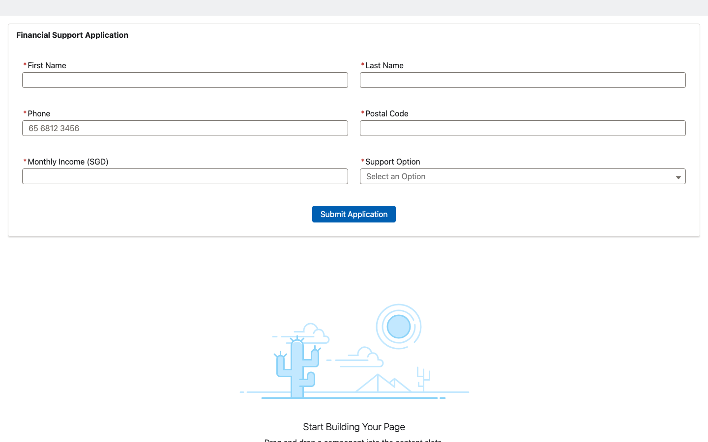
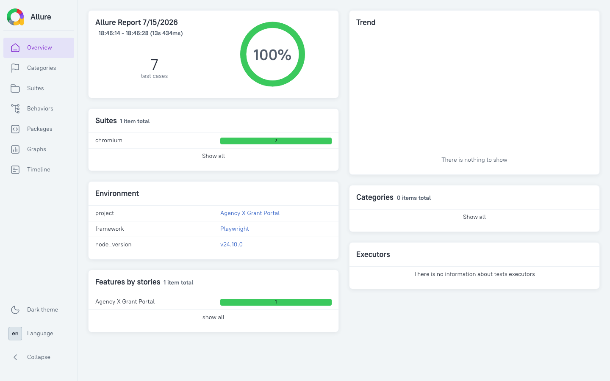

# Agency X Grant Portal — Salesforce + Playwright QA Automation

**Production-ready Salesforce grant-management app with an end-to-end
Playwright automation framework** built on the Page Object Model, custom
fixtures, Allure reporting and GitHub Actions CI.


[Live Allure Report](https://duishonabdykerimov.github.io/GovTechAssessment/) ·
[E2E Docs](tests/README.md)

---

## Overview

A financial-support grant portal built on the Salesforce platform (Apex, LWC,
triggers, validation rules and custom metadata) and exposed to the public
through an Experience Cloud site. Applicants submit their details, the system
evaluates eligibility, and disbursement schedules are generated automatically.

The repository is designed to demonstrate **Middle+/Senior QA Automation**
competencies: a scalable Page Object architecture, hybrid unit + E2E coverage,
CI/CD, and rich reporting.

## Key Features

| Area            | Implementation                                                       |
| --------------- | ------------------------------------------------------------------- |
| Architecture    | Page Object Model, custom Playwright fixtures, test-data builders    |
| App platform    | Salesforce Apex services + triggers, LWC UI, validation rules       |
| Test types      | E2E UI · Eligibility logic · Negative / validation                  |
| Unit tests      | LWC Jest (component) + Apex test classes                            |
| Reporting       | Playwright HTML + **Allure** (screenshots, steps, severity, tags)   |
| Authentication  | One-time Salesforce CLI login → shared `storageState`               |
| CI/CD           | GitHub Actions → tests → Allure → **GitHub Pages**                  |
| Config          | `.env` driven — no hardcoded credentials in tests                   |
| Best practices  | Auto-waiting, role-based locators, parallel-safe, idempotent data   |

## Architecture

```
force-app/main/default/      # Salesforce source
├── classes/                 # Apex services, controller, triggers, tests
├── lwc/grantApplicationForm # Lightning Web Component + Jest tests
├── objects/                 # Custom fields, validation rules
└── customMetadata/          # Support Option configuration

tests/                       # Playwright E2E framework
├── e2e/                     # Test scenarios (steps + Allure metadata)
├── pages/                   # Page Objects (locators + actions)
├── fixtures/                # Custom fixtures (pre-opened, authenticated page)
├── data/                    # Test-data builders (randomised, idempotent)
└── global-setup.js          # One-time authentication → storageState

.github/workflows/           # CI: unit + E2E + Allure publishing
```

## Screenshots

### Grant Application form (Experience Cloud)



### Allure Report (CI → GitHub Pages)



_Live Allure dashboard — 7 E2E scenarios, 100% pass rate, Chromium suite._

## Getting Started

```bash
# 1. Install dependencies
npm install
npx playwright install

# 2. Authenticate a Salesforce org
sf org login web --alias grant-portal

# 3. Configure environment
cp .env.example .env   # then fill in the values below
```

`.env`:

```bash
PORTAL_URL=https://<your-domain>.my.site.com/agencyxgrants/
SF_TARGET_ORG=<username-or-alias>
SF_SITE_ID=<Experience-site-id>
SF_COMMUNITY_PATH=<community-url-path>
```

## Running the tests

```bash
npm run test:unit           # LWC Jest unit tests
npm run test:e2e            # Playwright E2E (headless, parallel)
npm run test:e2e:headed     # watch it run in a real browser
npm run test:e2e:ui         # Playwright interactive UI mode
npm run allure:serve        # generate + open the Allure report
```

## Test coverage (E2E)

| Scenario                                   | Severity | Tags                   |
| ------------------------------------------ | -------- | ---------------------- |
| Application form renders all fields        | critical | smoke, ui              |
| Eligible applicant submits successfully    | blocker  | regression, happy-path |
| Applicant above income threshold not eligible | critical | regression, eligibility |
| Eligible submission with Option Two        | normal   | regression, happy-path |
| Eligible submission with Option Three      | normal   | regression, happy-path |
| Invalid Singapore phone number rejected    | normal   | regression, validation |
| Invalid Singapore postal code rejected     | normal   | regression, validation |

## CI/CD

Every push and pull request runs two jobs via **GitHub Actions**
(`.github/workflows/e2e-tests.yml`):

1. **LWC Unit Tests** — Jest with coverage.
2. **Playwright E2E** — authenticates to the org, runs the suite, and publishes
   the Allure report (with historical trends) to **GitHub Pages**.

### Required repository secrets

| Secret              | Description                                            |
| ------------------- | ----------------------------------------------------- |
| `SFDX_AUTH_URL`     | `sf org display --verbose` → *Sfdx Auth Url*          |
| `PORTAL_URL`        | Public Experience Cloud form URL                      |
| `SF_SITE_ID`        | Experience site id                                    |
| `SF_COMMUNITY_PATH` | Community URL path used for authenticated access       |
