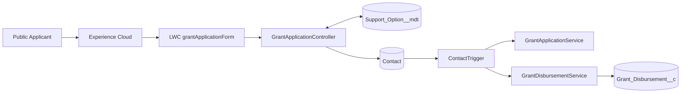
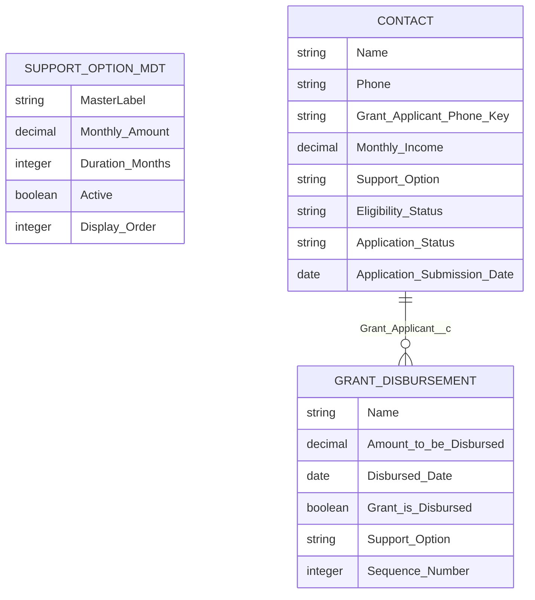

# Agency X Grant Portal — Salesforce

A financial-support grant portal on Salesforce (Apex, LWC, triggers, validation
rules and custom metadata), exposed publicly through an Experience Cloud site.
Applicants submit details on a Lightning form; the platform evaluates eligibility
and builds a monthly disbursement schedule automatically.

[](https://developer.salesforce.com)
[](https://github.com/DuishonAbdykerimov/GovTechAssessment/actions/workflows/e2e-tests.yml)
[](https://duishonabdykerimov.github.io/GovTechAssessment/)

> **QA automation** (Playwright, accessibility, visual regression, Docker, CI) →
> [`tests/README.md`](tests/README.md) · Live report:
> <https://duishonabdykerimov.github.io/GovTechAssessment/>
>
> **Architecture deep-dive** → [`docs/`](docs/)

<p align="center">
  
</p>

---

## 1. Overview

Agency X collects grant applications from the public. Each application is stored
as a **Contact** with grant-specific fields. When the applicant is **Eligible**
(monthly income **&lt; SGD 2,000**), the system creates a schedule of
`Grant_Disbursement__c` records based on the selected support option (configured
in Custom Metadata).

The public UI is the LWC `grantApplicationForm` on an Experience Cloud page.
Server-side work is layered: **Controller → Trigger Handler → Services**.

## 2. Business requirements

| Requirement                         | How it is met                                      |
| ----------------------------------- | -------------------------------------------------- |
| Public online application           | Experience Cloud + LWC form                        |
| Singapore phone & postal validation | Apex + Contact validation rules                    |
| Eligibility by monthly income       | `GrantApplicationService` (&lt; 2000 → Eligible)   |
| Configurable support programmes     | `Support_Option__mdt` (amount × duration)          |
| Automatic disbursement schedule     | `GrantDisbursementService` after insert/update     |
| Re-apply / update by phone          | Upsert on `Grant_Applicant_Phone_Key__c`           |
| Safe support-option changes         | Before-update validation + unpaid schedule rebuild |
| Bulk CSV load                       | Data Loader / CLI import using the phone key       |

## 3. Features implemented

- Public grant application form (first/last name, phone, postal code, income, support option)
- Active support options loaded from Custom Metadata (ordered by `Display_Order__c`)
- Eligibility: Pending / Eligible / Not Eligible
- Initial monthly disbursement schedule for eligible applicants
- Support-option change: block invalid downgrades; recalculate remaining unpaid months
- Idempotent upsert by normalised phone digits
- Layered Apex with unit tests; LWC Jest; Playwright E2E + Allure

## 4. Architecture

```
force-app/main/default/
├── classes/                   # Controller, services, trigger handler, Apex tests
├── lwc/grantApplicationForm/  # Public form + Jest tests
├── triggers/ContactTrigger.trigger
├── objects/
│   ├── Contact/               # Grant fields + validation rules
│   ├── Grant_Disbursement__c/ # Monthly payment schedule
│   └── Support_Option__mdt/   # Programme configuration
├── customMetadata/            # Option One / Two / Three records
└── ...
```



More detail: [`docs/architecture.md`](docs/architecture.md)

## 5. Data model

Applicants are modelled on **Contact** (not a separate custom object). Disbursements
are child records of Contact.



| Object                  | Role                                                 |
| ----------------------- | ---------------------------------------------------- |
| `Contact`               | Grant applicant + application fields                 |
| `Grant_Disbursement__c` | One row per scheduled (or paid) month                |
| `Support_Option__mdt`   | Programme definition (amount, months, active, order) |

**Support options (seeded):**

| Label        | Monthly amount |  Duration | Display order |
| ------------ | -------------: | --------: | ------------: |
| Option One   |        SGD 500 |  3 months |             1 |
| Option Two   |        SGD 300 |  6 months |             2 |
| Option Three |        SGD 200 | 12 months |             3 |

Full field list: [`docs/data-model.md`](docs/data-model.md)

## 6. Business rules

- Only Contacts with a non-blank `Application_Status__c` enter grant logic.
- `Application_Submission_Date__c` is set once (first save).
- `Grant_Applicant_Phone_Key__c` = digits-only phone (for upsert / matching).
- Eligibility: income `null` → **Pending**; `&lt; 2000` → **Eligible**; else **Not Eligible**.
- Eligible + support option → initial schedule: first payment = start of next month after submission, then monthly for `Duration_Months__c`.
- On support-option change: paid rows kept; unpaid rows deleted; remaining amount spread over remaining months (or blocked if invalid).

Details: [`docs/business-rules.md`](docs/business-rules.md)

## 7. Validation rules

On Contact (only when `Application_Status__c` is set):

| Rule                               | Enforces                                                    |
| ---------------------------------- | ----------------------------------------------------------- |
| `Require_Grant_Application_Fields` | First/Last name, Phone, Postal Code, Income, Support Option |
| `Validate_Singapore_Phone`         | `^65 [0-9]{4} [0-9]{4}$`                                    |
| `Validate_Singapore_Postal_Code`   | 6-digit postal code                                         |
| `Prevent_Negative_Monthly_Income`  | Income ≥ 0                                                  |

Controller-side checks mirror these for friendly Aura messages before DML.

## 8. Bulk processing

- Logic is bulk-safe (sets/maps, no SOQL/DML inside per-record loops for disbursement work).
- Upsert key: `Grant_Applicant_Phone_Key__c`.
- Sample files: [`data/grant_applicants.csv`](data/grant_applicants.csv),
  [`data/grant_applicants_update.csv`](data/grant_applicants_update.csv).

Guide: [`docs/bulk-upload.md`](docs/bulk-upload.md)

## 9. Experience Cloud setup

1. Deploy metadata to the org.
2. Create / use an Experience Cloud site (path example: `/agencyxgrants/`).
3. Add `grantApplicationForm` to a community page (`lightningCommunity__Page` target).
4. Grant the site guest / community profile access to:
   - Apex: `GrantApplicationController`
   - Objects/fields: Contact grant fields, read on `Support_Option__mdt`, create/read Contact as needed
5. Publish the site.

Demo URL (dev org):  
`https://playful-goat-wzkjld-dev-ed.trailblaze.my.site.com/agencyxgrants/`

## 10. Security model

- The public Apex controller uses `with sharing`.
- Guest-facing persistence and disbursement operations are isolated in narrowly scoped `without sharing` service classes.
- Public entry point is `@AuraEnabled` on `GrantApplicationController` only.
- Input validated in Apex; DML errors surfaced as `AuraHandledException`.
- Grant rules on Contact are gated by `Application_Status__c` so ordinary Contacts are untouched.
- Experience Cloud guest access is documented in `Grant_Portal_Guest_Access.permissionset-meta.xml` and is limited to the required Apex entry point and supporting access.
- ### Sharing design

`GrantApplicationController` is the only Apex entry point exposed to the LWC and runs `with sharing`.

`GrantApplicationPersistenceService` and `GrantDisbursementService` run `without sharing` only for the narrowly scoped operations required to:

- upsert an applicant by normalized phone External ID;
- update an applicant previously created by a guest user;
- create related grant disbursement records.

These service classes are not exposed directly to the Experience Cloud guest user.

Details: [`docs/security.md`](docs/security.md)

## 11. Testing strategy

| Layer               | Tool                   | Location                          |
| ------------------- | ---------------------- | --------------------------------- |
| Apex unit           | `@IsTest`              | `*Test.cls`                       |
| LWC unit            | Jest (`sfdx-lwc-jest`) | `lwc/.../__tests__/`              |
| E2E / a11y / visual | Playwright             | [`tests/`](tests/)                |
| CI                  | GitHub Actions         | `.github/workflows/e2e-tests.yml` |

Apex coverage highlights: eligible / not-eligible submit, phone-key upsert, invalid phone/postal/income, initial schedule, option change + partial disbursement, invalid downgrade block, bulk prepare.

## 12. Test results

- CI badge (above) reflects the latest workflow run.
- Allure report (suites, steps, screenshots, trends):  
  <https://duishonabdykerimov.github.io/GovTechAssessment/>

<p align="center">
  
</p>

## 13. Local setup

```bash
# Prerequisites: Salesforce CLI, Node.js 18+, authenticated org
sf org login web --alias grant-portal
npm install

# Optional: Playwright browsers for E2E
npx playwright install
cp .env.example .env   # fill PORTAL_URL, SF_TARGET_ORG, SF_SITE_ID, SF_COMMUNITY_PATH
```

## 14. Salesforce deployment

```bash
sf project deploy start --source-dir force-app --target-org grant-portal

# Apex tests
sf apex run test --target-org grant-portal --test-level RunLocalTests --result-format human --wait 30

# LWC unit tests
npm run test:unit
npm run test:unit:coverage
```

More: [`docs/deployment.md`](docs/deployment.md)

## 15. Docker usage

Reproducible Playwright runner (browsers + Salesforce CLI):

```bash
export SFDX_AUTH_URL="$(sf org display --verbose --target-org abdykerimovdk@playful-goat-wzkjld.com \
  --json | python3 -c 'import sys,json;print(json.load(sys.stdin)["result"]["sfdxAuthUrl"])')"
docker compose run --rm e2e
```

See [`Dockerfile`](Dockerfile) and [`tests/README.md`](tests/README.md#running-in-docker).

## 16. GitHub Actions

`.github/workflows/e2e-tests.yml` on push/PR:

1. LWC Jest (+ coverage artifact)
2. E2E matrix: Chromium / Firefox / WebKit
3. Visual regression (Chromium)
4. Merge Allure results → publish to GitHub Pages (`main` only)

Secrets: `SFDX_AUTH_URL`, `PORTAL_URL`, `SF_SITE_ID`, `SF_COMMUNITY_PATH`.

## 17. Allure report

```bash
npm run test:e2e
npm run allure:serve
```

Live: <https://duishonabdykerimov.github.io/GovTechAssessment/>

## 18. Demo URLs

| Resource              | URL                                                                                     |
| --------------------- | --------------------------------------------------------------------------------------- |
| Experience Cloud form | https://playful-goat-wzkjld-dev-ed.trailblaze.my.site.com/agencyxgrants/                |
| GitHub repository     | https://github.com/DuishonAbdykerimov/GovTechAssessment                                 |
| Allure report         | https://duishonabdykerimov.github.io/GovTechAssessment/                                 |
| CI workflow           | https://github.com/DuishonAbdykerimov/GovTechAssessment/actions/workflows/e2e-tests.yml |

## 19. Assumptions and trade-offs

| Choice                                | Rationale / trade-off                                                       |
| ------------------------------------- | --------------------------------------------------------------------------- |
| Contact as applicant                  | Fits assessment speed; avoids a parallel person model                       |
| Income threshold hard-coded (`2000`)  | Clear rule; could move to Custom Metadata later                             |
| Support option picklist + CMDT labels | Labels must stay in sync                                                    |
| Upsert by phone digits                | Simple identity for the assessment; production would need stronger identity |
| Schedule rebuild deletes unpaid rows  | Simple and correct for unpaid months; paid history preserved                |
| Experience Cloud guest access         | Must be configured carefully in the org                                     |
| Visual baselines OS-specific          | Linux baselines updated via dedicated workflow                              |

## 20. Repository structure

```
GovTechAssessment/
├── force-app/                 # Salesforce metadata (source of truth)
├── data/                      # Sample CSV imports
├── docs/                      # Architecture & domain docs
├── tests/                     # Playwright E2E framework + QA README
├── .github/workflows/         # CI (Jest + Playwright + Allure Pages)
├── Dockerfile                 # Reproducible E2E runner
├── docker-compose.yml
├── playwright.config.js
├── package.json
├── sfdx-project.json
└── README.md                  # This file (Salesforce product docs)
```

| Doc                                                | Contents                                 |
| -------------------------------------------------- | ---------------------------------------- |
| [`docs/architecture.md`](docs/architecture.md)     | Layers, call flow, diagrams              |
| [`docs/data-model.md`](docs/data-model.md)         | Objects, fields, relationships           |
| [`docs/business-rules.md`](docs/business-rules.md) | Eligibility & disbursement rules         |
| [`docs/security.md`](docs/security.md)             | Sharing, entry points, Experience access |
| [`docs/testing.md`](docs/testing.md)               | Apex / LWC / E2E strategy                |
| [`docs/deployment.md`](docs/deployment.md)         | Deploy & verify                          |
| [`docs/bulk-upload.md`](docs/bulk-upload.md)       | CSV bulk load                            |
| [`tests/README.md`](tests/README.md)               | Playwright QA handbook                   |

---

<div align="center">

**Author — Duishon Abdykerimov**

QA Automation Engineer

[](https://github.com/DuishonAbdykerimov)

<sub>Built with Salesforce · Playwright · Allure · GitHub Actions · Docker</sub>

</div>
