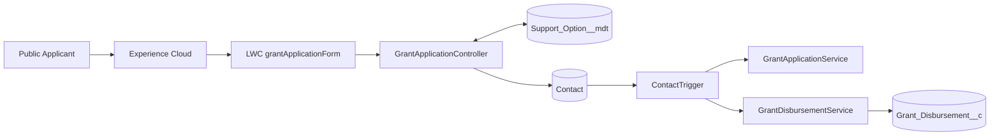
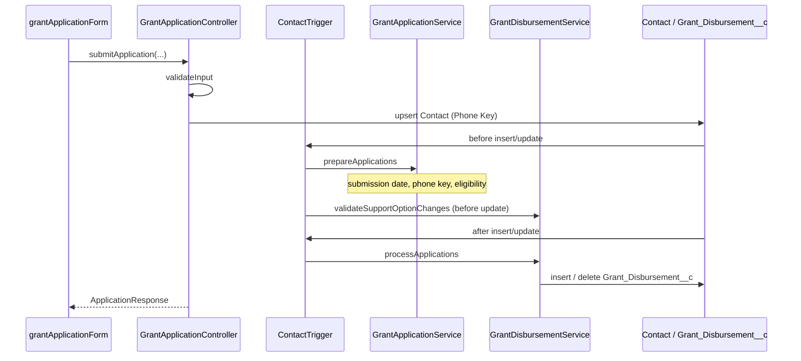

# Architecture

## Layering

| Layer   | Components                                          | Responsibility                                           |
| ------- | --------------------------------------------------- | -------------------------------------------------------- |
| UI      | `grantApplicationForm` (LWC)                        | Collect input, client validation, call Apex              |
| Entry   | `GrantApplicationController`                        | Support-option query, submit + server validation, upsert |
| Trigger | `ContactTrigger` → `GrantApplicationTriggerHandler` | Route before/after insert/update                         |
| Domain  | `GrantApplicationService`                           | Submission date, phone key, eligibility                  |
| Domain  | `GrantDisbursementService`                          | Option-change guards + disbursement schedule             |
| Config  | `Support_Option__mdt`                               | Programme amount / duration / active / order             |
| Data    | `Contact`, `Grant_Disbursement__c`                  | Applicant + monthly payments                             |

## System flow

## Trigger orchestration

## Why this shape

- **Thin controller** — UI-facing validation and upsert only.
- **Trigger handler** — keeps the trigger one line and testable.
- **Services** — eligibility and disbursement stay independent and bulk-safe.
- **Custom Metadata** — programme changes without a code deploy (activate / amounts / months).
