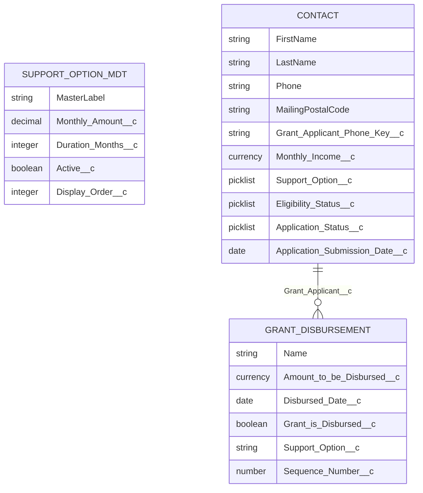

# Data model

## Entity relationship

Applicants are stored on standard **Contact**. There is no separate Grant Application custom object.

## Contact (grant fields)

| API name                         | Type                        | Purpose                                                    |
| -------------------------------- | --------------------------- | ---------------------------------------------------------- |
| `Phone`                          | Phone                       | Display format `65 #### ####`                              |
| `MailingPostalCode`              | Text                        | 6-digit Singapore postal code                              |
| `Monthly_Income__c`              | Currency                    | Used for eligibility                                       |
| `Support_Option__c`              | Picklist                    | Option One / Two / Three                                   |
| `Application_Status__c`          | Picklist                    | Submitted / Approved / Rejected — **gate** for grant logic |
| `Eligibility_Status__c`          | Picklist                    | Pending / Eligible / Not Eligible                          |
| `Application_Submission_Date__c` | Date                        | Set once on first grant save                               |
| `Grant_Applicant_Phone_Key__c`   | Text (External ID / Unique) | Digits-only phone; upsert key                              |

> `Grant_Applicant_Phone_Key__c` must be **External ID** and **Unique** in the org so
> `upsert applicant Grant_Applicant_Phone_Key__c` works for re-applications.

## Grant_Disbursement__c

| API name                    | Type             | Purpose                        |
| --------------------------- | ---------------- | ------------------------------ |
| `Grant_Applicant__c`        | Lookup → Contact | Parent applicant               |
| `Amount_to_be_Disbursed__c` | Currency         | Monthly amount                 |
| `Disbursed_Date__c`         | Date             | Scheduled (or paid) month date |
| `Grant_is_Disbursed__c`     | Checkbox         | Paid flag                      |
| `Support_Option__c`         | Text             | Option label at schedule time  |
| `Sequence_Number__c`        | Number           | 1..N month index               |

## Support_Option__mdt

| API name             | Type     | Purpose                        |
| -------------------- | -------- | ------------------------------ |
| `MasterLabel`        | Label    | Matches Contact picklist value |
| `Monthly_Amount__c`  | Number   | SGD per month                  |
| `Duration_Months__c` | Number   | Schedule length                |
| `Active__c`          | Checkbox | Shown in UI / usable in logic  |
| `Display_Order__c`   | Number   | Combobox order                 |

### Seeded records

| Label        | Monthly | Months | Order |
| ------------ | ------: | -----: | ----: |
| Option One   |     500 |      3 |     1 |
| Option Two   |     300 |      6 |     2 |
| Option Three |     200 |     12 |     3 |
