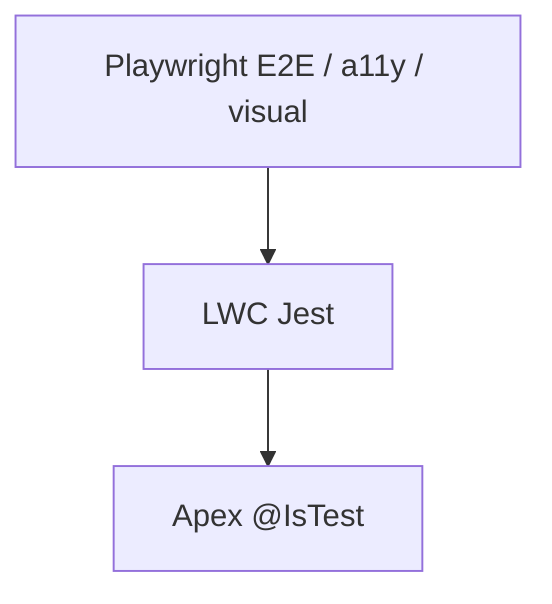

# Testing strategy

## Pyramid



## Apex unit tests

| Class                            | Covers                                                                                                                      |
| -------------------------------- | --------------------------------------------------------------------------------------------------------------------------- |
| `GrantApplicationControllerTest` | Active options, eligible / not-eligible submit, phone-key upsert, invalid phone/postal/income/required/unknown option       |
| `GrantApplicationServiceTest`    | Ordinary Contact skip, eligible prepare, income at limit → Not Eligible, bulk prepare                                       |
| `GrantDisbursementServiceTest`   | Initial Option One schedule, unpaid replace on option change, partial disbursement recalculation, invalid downgrade blocked |

Run:

```bash
sf apex run test --target-org <org> --class-names GrantApplicationControllerTest,GrantApplicationServiceTest,GrantDisbursementServiceTest --result-format human --wait 30
```

## LWC unit tests

`force-app/main/default/lwc/grantApplicationForm/__tests__/grantApplicationForm.test.js`

- Loads support options from the Apex wire adapter
- Submits a valid application
- Surfaces Apex error messages
- Handles support-options wire failure

```bash
npm run test:unit
npm run test:unit:coverage
```

## End-to-end (Playwright)

Documented in [`tests/README.md`](../tests/README.md):

- Functional + negative scenarios (Chromium, Firefox, WebKit)
- axe-core WCAG 2.1 A/AA
- Visual regression (Chromium)
- Allure reporting + GitHub Actions matrix

## CI

`.github/workflows/e2e-tests.yml` runs Jest, the browser matrix, visual tests, then publishes Allure to GitHub Pages.
